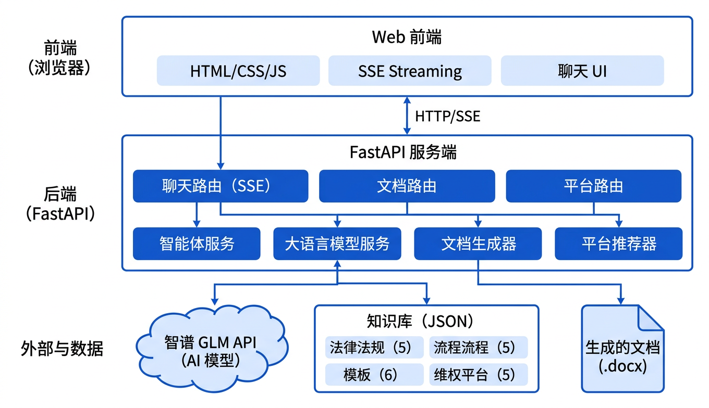
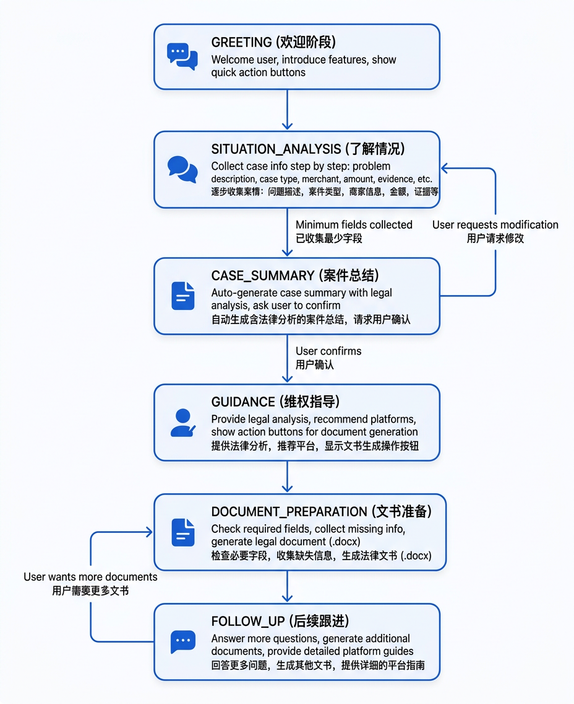
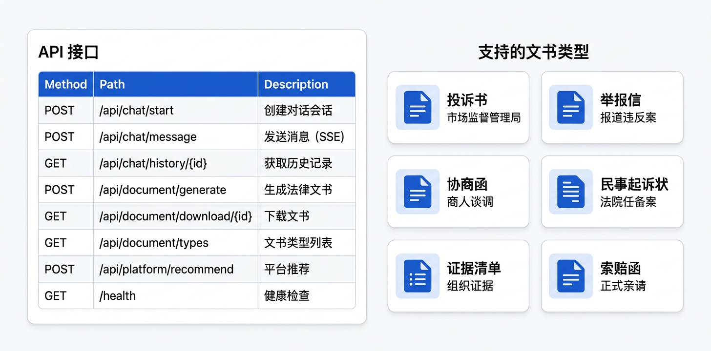

# 法律维权助手

基于 AI 的消费者维权智能咨询系统，帮助普通消费者了解维权流程、生成法律文书、推荐投诉平台。

## 功能特性

- **智能对话咨询**：通过对话逐步收集案件信息，提供专业的法律建议
- **法律依据分析**：自动匹配相关法律条文（消保法、食安法等）
- **文书生成**：一键生成投诉书、举报信、协商函、民事起诉状等法律文书（.docx 格式）
- **平台推荐**：智能推荐最适合的投诉平台（12315、12345、黑猫投诉、法院等）
- **流程指导**：详细的投诉流程步骤说明

## 系统架构



| 组件 | 技术 |
|------|------|
| 后端框架 | Python 3.9+ / FastAPI |
| AI 模型 | 智谱 GLM (zhipuai SDK) |
| 文书生成 | python-docx |
| 前端 | Jinja2 + 原生 HTML/CSS/JS |
| 知识库 | JSON 文件 |
| 部署 | Docker / docker-compose |

## 对话流程

系统采用六阶段对话流程，引导用户从问题描述到文书生成：



## API 接口与文书类型



## 项目结构

```
law-agent/
├── main.py                      # FastAPI 入口
├── config.py                    # 配置管理
├── requirements.txt             # 依赖列表
├── Dockerfile                   # Docker 镜像配置
├── docker-compose.yml           # Docker Compose 编排
├── .env                         # 环境变量（API Key）
│
├── app/
│   ├── dependencies.py          # 共享服务实例
│   ├── routers/
│   │   ├── chat.py              # 对话 API (SSE 流式)
│   │   ├── document.py          # 文书生成 API
│   │   └── platform.py          # 平台推荐 API
│   │
│   ├── services/
│   │   ├── agent.py             # 核心 Agent 逻辑
│   │   ├── llm.py               # 智谱 GLM 封装
│   │   ├── document_generator.py # 文书生成
│   │   ├── platform_recommender.py # 平台推荐
│   │   └── knowledge.py         # 知识库加载
│   │
│   ├── models/
│   │   ├── schemas.py           # 数据模型
│   │   └── enums.py             # 枚举定义
│   │
│   └── prompts/
│       ├── system_prompts.py    # 系统提示词
│       ├── consultation.py      # 咨询提示词
│       └── document_prompts.py  # 文书生成提示词
│
├── knowledge/
│   ├── laws/                    # 法律条文（5部法律）
│   ├── processes/               # 投诉流程（5个平台）
│   ├── platforms/               # 平台信息与推荐规则
│   └── templates/               # 文书模板（6种）
│
├── templates/
│   └── index.html               # 前端页面
│
├── static/
│   ├── css/style.css
│   ├── js/chat.js
│   └── generated/               # 生成的文书存放目录
│
└── docs/
    └── images/                  # 文档图示
```

## 快速开始

### 方式一：本地运行

#### 1. 安装依赖

```bash
python3 -m venv venv
source venv/bin/activate  # Linux/Mac
# venv\Scripts\activate   # Windows

pip install -r requirements.txt
```

#### 2. 配置 API Key

复制环境变量模板并填入你的智谱 AI API Key：

```bash
cp .env.example .env
```

编辑 `.env` 文件：

```
ZHIPUAI_API_KEY=your_api_key_here
GLM_MODEL=glm-4-plus
```

> 获取 API Key：访问 [open.bigmodel.cn](https://open.bigmodel.cn) 注册并创建 API Key

#### 3. 启动服务

```bash
python main.py
```

服务启动后访问 http://localhost:8000

### 方式二：Docker 部署

#### 1. 配置环境变量

```bash
cp .env.example .env
# 编辑 .env 填入 API Key
```

#### 2. 构建并启动

```bash
docker-compose up -d
```

服务启动后访问 http://localhost:8000

#### 常用命令

```bash
# 查看日志
docker-compose logs -f

# 停止服务
docker-compose down

# 重新构建
docker-compose up -d --build
```

## API 接口

| 方法 | 路径 | 说明 |
|------|------|------|
| POST | `/api/chat/start` | 创建对话会话 |
| POST | `/api/chat/message` | 发送消息（SSE 流式响应） |
| GET | `/api/chat/history/{session_id}` | 获取对话历史 |
| POST | `/api/document/generate` | 生成法律文书 |
| GET | `/api/document/download/{file_id}` | 下载文书 (.docx) |
| GET | `/api/document/types` | 文书类型列表 |
| POST | `/api/platform/recommend` | 获取平台推荐 |
| GET | `/health` | 健康检查 |

## 支持的纠纷类型

- **商品质量问题**：假货、损坏、与描述不符
- **虚假宣传**：夸大宣传、虚假广告
- **退款纠纷**：拒绝退款、拖延退款
- **食品安全**：过期、变质、不卫生
- **服务质量问题**：服务态度差、服务缩水

## 支持的文书类型

| 文书 | 用途 |
|------|------|
| 投诉书 | 向市场监督管理局投诉 |
| 举报信 | 举报商家违法行为 |
| 协商函 | 向商家发送正式协商函 |
| 民事起诉状 | 向法院提起诉讼 |
| 证据清单 | 整理维权证据 |
| 索赔函 | 正式索赔函件 |

## 投诉平台推荐

系统会根据案件情况智能推荐：

1. **12315 平台** - 政府权威渠道，有执法权
2. **12345 热线** - 政务服务便民热线
3. **黑猫投诉** - 新浪旗下媒体平台，舆论压力大
4. **消费者协会** - 免费调解服务
5. **人民法院** - 最终法律手段

## 注意事项

- 本系统仅供参考，不构成正式法律意见
- 复杂案件建议咨询专业律师
- 生成的文书请检查后使用，补充个人信息

## License

MIT
